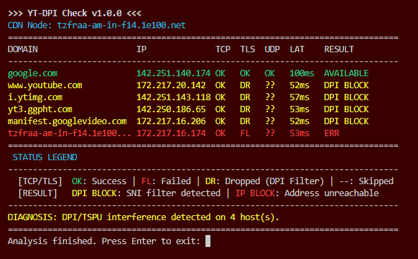

# YT-DPI Check

[[Русский язык](README_ru.md)]

### Overview

**YT-DPI Check** is a lightweight PowerShell utility designed to identify the exact cause of YouTube accessibility issues. It performs a multi-layered network analysis to distinguish between simple connection failures and sophisticated DPI (Deep Packet Inspection) filtering.

### Key Features
*   **DNS Integrity Check:** Detects DNS resolution errors or potential IP spoofing.
*   **TCP Connectivity Check:** Verifies if Google/YouTube servers are reachable on port 443.
*   **SNI Handshake Test:** Simulates a secure connection to detect DPI interference (packet dropping when SNI is detected).
*   **CDN Node Discovery:** Automatically finds and tests your local Google Global Cache (GGC) node.
*   **Compact UI:** Table layout optimized for standard console windows (80 columns).
*   **Auto-Diagnosis:** The script analyzes results and provides a final summary.

### How to Use
1. Download the **`YT-DPI-Check.bat`** file from the latest [release](../../releases/latest).
2. Run it by double-clicking.
3. The script will automatically bypass PowerShell execution policies and display the result.
   *No additional steps or settings are required.*

### Status Legend
*   **OK**: Connection successful.
*   **FL** (Failed): Connection error (port closed or reset).
*   **DR** (Dropped): Packet sent, but no response received. Key indicator of DPI blocking.
*   **--** (Skipped): Test was not performed due to previous step failure.

### Understanding Verdicts (Result)
| Result | Meaning |
| :--- | :--- |
| **AVAILABLE** | Connection is fully functional. |
| **DPI BLOCK** | SNI filtering detected (DPI-level blocking). |
| **IP BLOCK** | The IP address is unreachable. Possible IP-level blacklist. |
| **DNS ERROR** | Failed to resolve the domain name to an IP address. |

## License
This project is licensed under the MIT License - see the [LICENSE](LICENSE) file for details.

---
*Disclaimer: This tool is for diagnostic and educational purposes only.*
